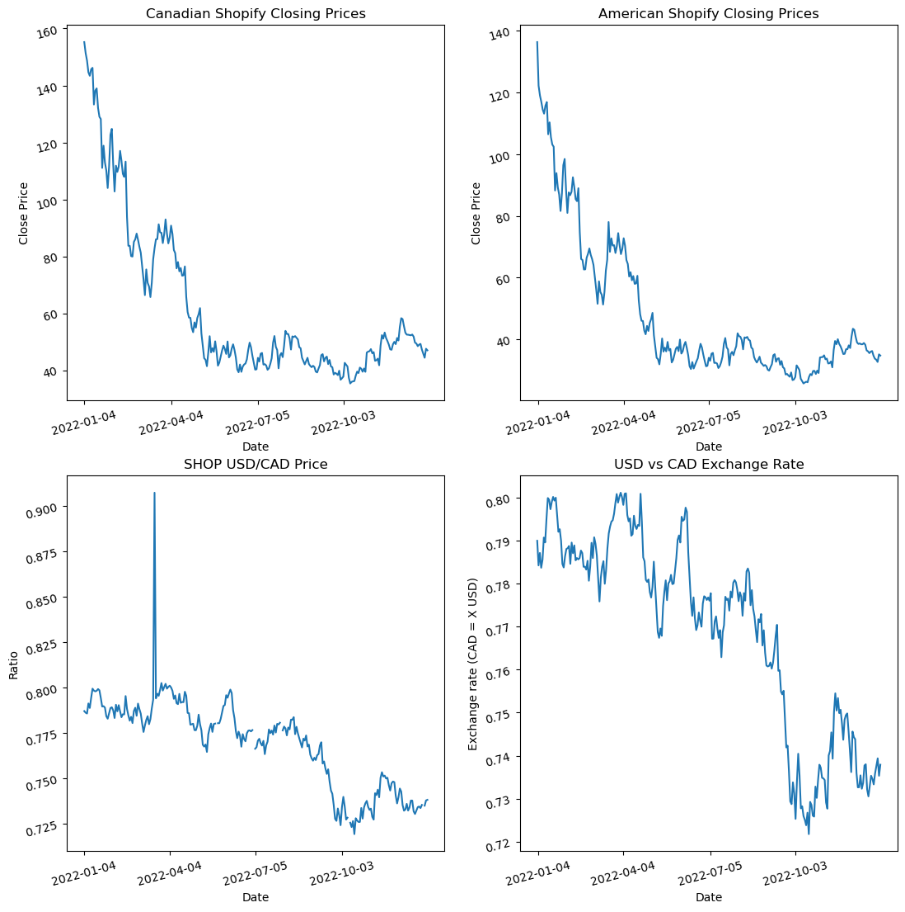

# Arbitrage

## Table of Contents
1. Introduction
2. Idea
3. Methodologies
4. Flaws

#### 1. Introduction:

"Arbitrage is a financial strategy where investors simultaneously buy and sell the same asset in different markets to profit from temporary price differences. The goal is to exploit these discrepancies and make a risk-free profit" - Google AI Overview 

Imagine gold is selling for:

$1,800 per ounce in New York
$1,820 per ounce in London

A trader could:

1. Buy 1 ounce of gold in New York for $1,800
2. Sell that same ounce in London for $1,820
3. Profit = $20 (excluding transaction costs)

Because the transactions happen nearly simultaneously, the trader locks in the profit without taking on market risk — this is pure arbitrage.

#### 2. Idea

By obversing the price of dual-listed stocks on NASDAQ and TSX and the USD/CAD exchange rate. The goal is to spot an instance where there is a price discrepancy, and then executing trades to buy low and sell high.

#### 3. Methodologies

The project is made using Python (along with Pandas, Matplotlib) to perform data cleaning, visualization and yfinance API to get market data. 

I fetch the price data for Shopify and with exchange rates for USD/CAD. And then I construct 4 plots to repersent the data fetched.

a. TSX closing price
b. NASDAQ closing price
c. NASDAQ price / TSX price (without factoring the exchange rate)
d. USD/CAD exchange rate.

Graph c. and d. in thoery should move together with `perfect correlation` as the secruity price ratio from NASDAQ/TSX should repersent the exchange rate. 

By doing the Canadian Shopify price - implied close price ( US price * USD/CAD rate). We are able to spot arbitrage opportunities.

#### 3.b Interesting Event Captured 
We see that in graph c. there is a huge spike between the USD/CAD price. This occured in March 18, 2022. The trigger for this isolated uptick was the quarterly rebalancing of the Nasdaq-100 Index, which is tracked by the Invesco QQQ Trust (QQQ). Under Nasdaq rules, index share adjustments are announced after the close on the second Friday of March and become effective after the close of trading on the third Friday in March. For March 2022, that date was March 18, meaning ETF managers executed large purchase orders for Shopify shares on that day to align QQQ’s portfolio with the new index composition. [Read more about this event here](https://markets.businessinsider.com/news/stocks/nyse-shopify-stock-price-spike-probe-caused-18m-losses-report-2022-3) and [here](https://seekingalpha.com/news/3818190-shopify-100share-price-spike-earlier-this-month-said-to-be-probed-by-nyse?utm_medium=referral&utm_source=chatgpt.com).

#### 4. Flaws

Events like this is extremely rare. It is unlikely to make a profit from such event.
