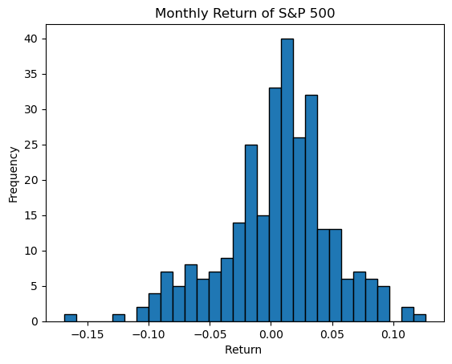
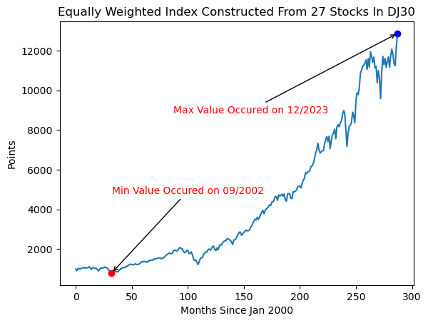
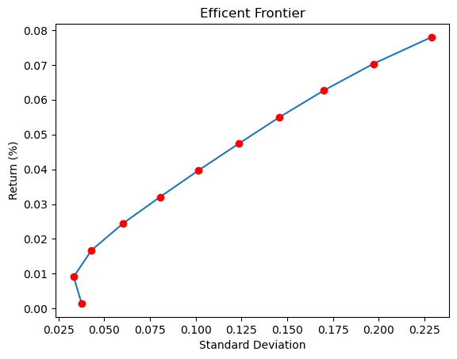
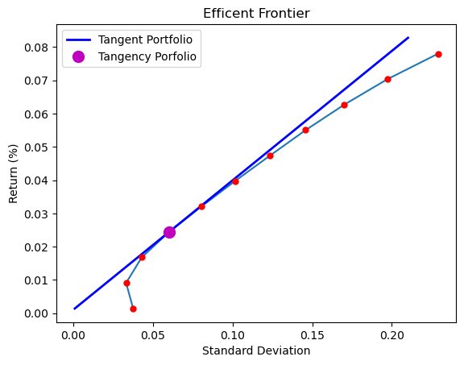

# Mean Variance Analytics Portfolio
---
## Table of Contents
1. Introduction
2. Dataset Descriptions
3. Methodologies
4. Skewness Discussion
5. VaR Discussion
6. Equally Weighted Index Constructed From 27 Stocks
7. Minimum Variance Portfolio
8. Tangent Portfolio
9. Utility Optimization

---

## 1. Introduction
This report provides an analysis of financial data for the Dow Jones Industrial Average. The data was obtained from WRDS.

---

## 2. Dataset Descriptions
Data for this report is taken from a excel spreadsheet, obtained from WRDS

### **Sheet: sp500[^1]**
1. **Calendar Date**: The date of the observation in the dataset.
2. **Value-Weighted Return (incl. dividends)**: The return on the value-weighted portfolio of securities, including dividends.
3. **Value-Weighted Return (excl. dividends)**: The return on the value-weighted portfolio of securities, excluding dividends.
4. **Equal-Weighted Return (incl. dividends)**: The return on the equally weighted portfolio of securities, including dividends.
5. **Equal-Weighted Return (excl. dividends)**: The return on the equally weighted portfolio of securities, excluding dividends.
6. **Total Market Value**: The combined market value of all securities in the dataset.
7. **Total Market Count**: The total number of securities included in the dataset.
8. **Market Value of Securities Used**: The aggregated market value of the securities used for calculations.
9. **Count of Securities Used**: The total number of securities used in the computations.
10. **Level of the S&P 500 Index**: The closing level of the S&P 500 Index on the observation date.
11. **Return on the S&P 500 Index**: The return on the S&P 500 Index for the given observation period.

### **Sheet: d27returns[^2]**
1. **PERMNO**: A unique identifier assigned to each security in the dataset.
2. **Names Date**: The date associated with the name or ticker change for the security.
3. **Ticker Symbol**: The trading symbol for the security.
4. **Company Name**: The name of the company associated with the security.
5. **Price or Bid/Ask Average**: The average price or bid/ask price for the security on the given date.
6. **Returns**: The percentage return of the security for the observation period.
7. **Shares Outstanding**: The total number of shares of the security outstanding during the observation period.
8. **Year**: The calendar year corresponding to the observation.

[^1]: In this dataset, only the "Return on the S&P 500 Index" was used.
[^2]: In this dataset, "PERMNO," "Names Date," "Ticker Symbol," "Company Name," "Returns," and "Year" were used.

---

## 3. Methodologies 

The analysis was conducted using Python. The libraries used were:

1. **numpy**: A numerical computation library used for performing matrix operations.  
2. **pandas**: A library for working with datasets.
3. **matplotlib**: A library for plotting data.
4. **scipy**: A library used for optimization, particularly for minimizing scalar functions, which was used to find the minimum variance portfolio.

#### 4. Skewness Discussion

  
  

    

      We observe that the market return is negatively skewed. This means that the median return is lower than the arithmetic mean. This indicates that unfavorable results in certain investments have had a significant impact on the overall index return. During the period of interest, several key events contributed to this negative skewness. Three major sectors of the index experienced substantial losses:
    

    

      1. Technology Sector (Dot-Com Bubble Burst): Companies like Intel and Cisco lost significant value.

      

      2. Financial Sector (Subprime Mortgage Crisis): Nearly all companies were affected in the chain reaction following the default of Lehman Brothers.  
      

      3. Energy Sector: During the COVID-19 pandemic, energy companies sustained major losses.  
    

    

      Since the S&P 500 is a value-weighted index, the poor performance in the aforementioned sectors has driven the skewness to be negative. However, the observed skewness is only -0.47, indicating that, aside from these events, the market has been relatively stable.  
    

  

#### 5. VaR Discussion

Value at Risk (VaR) measures the downside risk in a portfolio under a given confidence level *x*, indicating the probability that the loss will not exceed the VaR over a specified time period. VaR is computed by sorting the data points and selecting the value at the *x* percentile. Intuitively, data points at lower percentiles have lower values, indicating greater losses, while *100 - x%* of the data points are greater than the *x* percentile, signifying smaller losses or gains.

For the S&P 500 return data, the 5% VaR is -8.11%. This means there is a 95% probability that the month-to-month return will be greater than -8.11%, and a 5% probability of experiencing a loss exceeding -8.11%. 

#### 6. Equally Weighted Index Constructed From 27 Stock

Formula:
$$
\text{Index Price}_t = \text{Index Price}_{t-1} \times \left( 1 + \frac{1}{N} \sum_{i=1}^{N} R_{i,t} \right)
$$
By providing an intial price of 1000:

  
  

  
 The minimum value of the index reached was on 09/2002 with 765 points a. In September 2002, the financial markets experienced a sharp decline in investor confidence, which led to market adjustments. This decline was due to a number of factors, including the bursting of the dot-com bubble, corporate governance scandals, and fears of war and terrorism. The Dow Jones Industrial Average lost 27% of its value from January 1, 2001 to September 24, 2002.
   

   

   The index reached its highest point at 12/2023 with 12864 points. After COVID, all businesses experienced strong growth, driving stocks to all time high.
   

   

#### 7. Minimum Variance Portfolio

Using the bulit in Scipy optimize, here is the generated holdings for each comapny in the minimum variance portfolio. 
| Company                                | % Holding  | Company                                | % Holding  | Company                                | % Holding  |
|----------------------------------------|------------|----------------------------------------|------------|----------------------------------------|------------|
| MICROSOFT CORP                         | 0.0401     | APPLE COMPUTER INC                     | 0.0390     | MINNESOTA MINING & MFG CO              | 0.0443     |
| HONEYWELL INTERNATIONAL INC            | -0.0495    | PROCTER & GAMBLE CO                    | 0.1495     | MERCK & CO INC                         | 0.0611     |
| COCA COLA CO                           | 0.1065     | CATERPILLAR INC                        | -0.0549    | DISNEY WALT CO                         | 0.0072     |
| INTERNATIONAL BUSINESS MACHS COR       | 0.0480     | WALGREEN CO                            | 0.0336     | MCDONALDS CORP                         | 0.0651     |
| AMGEN INC                              | 0.0722     | BOEING CO                              | -0.0234    | CHASE MANHATTAN CORP NEW               | -0.0106    |
| CHEVRON CORP                           | 0.0490     | JOHNSON & JOHNSON                      | 0.1025     | WAL MART STORES INC                    | 0.1289     |
| NIKE INC                               | 0.0194     | AMERICAN EXPRESS CO                    | -0.0474    | INTEL CORP                             | 0.0072     |
| ST PAUL COS INC                        | 0.0324     | BELL ATLANTIC CORP                     | 0.0716     | HOME DEPOT INC                         | 0.0336     |
| CISCO SYSTEMS INC                      | 0.0053     | GOLDMAN SACHS GROUP INC                | -0.0130    | UNITED HEALTHCARE CORP                 | 0.0826     |

Notice here we have negative values in % holdings. This mean that we are shorting the assets. 

With the portfolio above, we are able to achieve a standard deviation of **0.03312** and an expected monthly return **0.00832**

#### 8. Buliding the Efficient Frontier

  
  

  

    Here we see that the shape does resembles the characters of efficient frontier. Using only 11 data points, we are able to outline the rough shape of the frontier.
  

  
  

#### 9. Tangent Portfolio

Approach: For each of the data point on my efficient frontier, I will determine their Sharpe Ratio and choose the tangent portfolio based on the Sharpe ratio.

The **Sharpe Ratio** is calculated as:

$$
S = \frac{R_p - R_f}{\sigma_p}
$$

Where:
- \( S \) = Sharpe Ratio
- \{ R_p \} = Expected portfolio return
- \( R_f \) = Risk-free rate
- \( \sigma_p \) = Standard deviation of portfolio returns

  
  

  

    Here, we see that the highest Sharpe Ratio appears when standard deviation is 0.06016 and return of 0.0244.

  

  
  

Below is the portfolio weighing for the tangency portfolio.

| Company                                | % Holding  | Company                                | % Holding  | Company                                | % Holding  |
|----------------------------------------|------------|----------------------------------------|------------|----------------------------------------|------------|
| MICROSOFT CORP                         | 0.1074     | APPLE COMPUTER INC                     | 0.3329     | MINNESOTA MINING & MFG CO              | -0.1562    |
| HONEYWELL INTERNATIONAL INC            | -0.0194    | PROCTER & GAMBLE CO                    | 0.1366     | MERCK & CO INC                         | 0.0285     |
| COCA COLA CO                           | -0.0077    | CATERPILLAR INC                        | 0.1959     | DISNEY WALT CO                         | -0.1565    |
| INTERNATIONAL BUSINESS MACHS COR       | -0.1067    | WALGREEN CO                            | -0.1367    | MCDONALDS CORP                         | 0.1541     |
| AMGEN INC                              | 0.1406     | BOEING CO                              | 0.1368     | CHASE MANHATTAN CORP NEW               | 0.0791     |
| CHEVRON CORP                           | -0.0142    | JOHNSON & JOHNSON                      | 0.0656     | WAL MART STORES INC                    | -0.0112    |
| NIKE INC                               | 0.1926     | AMERICAN EXPRESS CO                    | -0.1346    | INTEL CORP                             | -0.1335    |
| ST PAUL COS INC                        | 0.1208     | BELL ATLANTIC CORP                     | -0.1181    | HOME DEPOT INC                         | 0.0248     |
| CISCO SYSTEMS INC                      | -0.0660    | GOLDMAN SACHS GROUP INC                | -0.1235    | UNITED HEALTHCARE CORP                 | 0.4688     |
